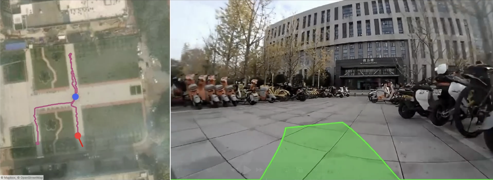

<div align="center">
<h1>Data Scaling for Navigation in Unknown Environments</h1>
  
[**Lauri Suomela**](https://lasuomela.github.io/)<sup>&dagger;</sup> · [**Naoki Takahata**](https://www.linkedin.com/in/naoki-takahata-a122a7263/) · [**Sasanka Kuruppu Arachchige**](https://github.com/SasaKuruppuarachchi) · [**Harry Edelman**](https://www.linkedin.com/in/harryedelman/) · [**Joni-Kristian Kämäräinen**](https://scholar.google.fi/citations?user=r6Y4nacAAAAJ&hl=fi)
<br>
<i>Computer Vision Group, Tampere University</i>
<br>
&dagger;Corresponding author

<a href="https://arxiv.org/abs/2601.09444"></a>
<a href='https://lasuomela.github.io/navigation_scaling/'></a>
<a href='https://huggingface.co/collections/lauriasuo/frodobots'></a>
</div>

This repository contains code to train and deploy navigation policies with the [EarthRover Zero](https://shop.frodobots.com/collections/earth-rovers/products/earthroverzero) robots.

The associated paper presents a large-scale study of data scaling for navigation in unknown environments, using a dataset of thousands of hours of real-world navigation data collected by the [FrodoBots](https://www.frodobots.ai/) team. Here, we provide the codebase used for running the experiments. Besides the training and deployment code, we also include the data wrangling pipeline used to process the raw dataset into the format used for training.

<p align="center">
  
  <em>View from the robot's front camera in Wuhan, China, with the policy's action prediction overlaid in green.</em>
</p>

## Repository structure

- `earthrovers/data_wrangling/`: raw dataset processing pipeline and tooling
- `earthrovers/train/`: Hydra + PyTorch Lightning training code
- `earthrovers/deployment/src/earthrovers_deployment/`: ROS2 deployment package and model configs
- `docker/`: deployment container scripts
- `slurm_tools/`: cluster training/export helpers


## Deployment

This repository is built for policy deployment on EarthRover Zero robots over a remote connection.


### 1. Deployment dependencies

1. Install the EarthRovers SDK, and acquire an API key following the instructions in the repo:
   - https://github.com/frodobots-org/earth-rovers-sdk
2. Install the `earthrovers_ros` ROS2 driver:
   - https://github.com/naokii11111/earthrovers_ros/tree/ros2-humble

### 2. Start the EarthRovers SDK and ROS driver

Follow the instructions in the respective repos.

SDK quickstart:
```bash
# Start the EarthRovers SDK after setting the correct robot/mission settings
hypercorn main:app --reload
```

ROS driver quickstart:
```bash
# Build the ROS2 driver container
.../earthrovers_ros/dockerfiles/build.sh

# Run the container
.../earthrovers_ros/dockerfiles/run.sh

# Inside the container:

# Start the mission (we have defined some useful aliases)
start-mission

# Fetch data once to verify connection
get-data

# Launch the ROS driver
launch-zero

# After you are done, stop the mission
end-mission
```

### 3. Build and run the deployment container

```bash
docker/build.sh
docker/run.sh
```

### 4. Build the ROS2 deployment package

```bash
# Inside the deployment container
cd /opt/NavigationScaling/earthrovers/deployment/src
colcon build
```

### 5. Launch the navigation policy

Launch the navigation node with the default parameters:

```bash
# Inside the deployment container
cd /opt/NavigationScaling/earthrovers/deployment/src/earthrovers_deployment/earthrovers_deployment
python navigation_node.py
```

If everything is set up correctly, you should see the node start and begin processing data from the robot. You can toggle policy execution with the keyboard input: `k` to toggle the policy on/off, and `q` to quit the node.

By default, the node will run the policy specified by the ROS parameter `model`, and fetch the corresponding policy config from `earthrovers/deployment/src/earthrovers_deployment/config/huggingface_config.yaml`. The model weights for the policies in this config are automatically pulled from Hugging Face. See the config file for the available policies and their metadata.

You can also deploy your local Lightning checkpoints, produced by the training code, by following the example in `earthrovers/deployment/src/earthrovers_deployment/config/local_config.yaml` and overriding the `ckpt_path` parameter to point to your checkpoint.

## Downloading and processing the dataset

Data wrangling has its own documentation:

- See `earthrovers/data_wrangling/README.md`

That README covers:

- downloading raw FrodoBots 2K/8k datasets
- processing raw rides into the Hugging Face dataset format used by training
- optional Rerun exports for visualization
- dataset schema and examples

## Training models

### 1. Environment setup

1. Install Mamba/Conda.
2. Create the training environment:

```bash
conda env create -f earthrovers/train/environment.yml
```

3. Activate it:

```bash
mamba activate earthrovers
```

4. Install Theia without dependencies (used by encoder backbones):

```bash
pip install git+https://github.com/bdaiinstitute/theia.git --no-deps
```

5. Install this repository as an editable package:

```bash
pip install -e .
```

### 2. Start training (Hydra)

Training uses Hydra structured configs plus experiment YAMLs under `earthrovers/train/config/experiments/`.

Run training with an experiment config and dataset path override:

```bash
python -m earthrovers.train.run \
  --config-name=experiments/generalization/full.yaml \
  earthrovers.dataloader.dataset_path=/path/to/processed/dataset
```

Useful experiment groups:

- `earthrovers/train/config/experiments/generalization/`
- `earthrovers/train/config/experiments/model_ablations/`
- `earthrovers/train/config/experiments/data_mixes/`

Common overrides:

```bash
python -m earthrovers.train.run \
  --config-name=experiments/model_ablations/mlp_theia.yaml \
  earthrovers.dataloader.dataset_path=/path/to/processed/dataset \
  earthrovers.dataloader.batch_size=16 \
  earthrovers.dataloader.num_workers=8 \
  earthrovers.trainer.num_gpus=1 \
  earthrovers.trainer.num_epochs=10 \
  earthrovers.trainer.wandb.entity=<your_wandb_entity> \
  earthrovers.trainer.wandb.run_name=my_run
```

See `earthrovers/train/config/default_structured_configs.py` for all available config options and their defaults.

### 3. Notes
- A local launch example is available in `slurm_tools/local_test.sh`.
- SLURM launch script example (for the [EuroHPC LUMI](https://lumi-supercomputer.eu/lumi_supercomputer/) supercomputer!) is available in `slurm_tools/train.sh`. The training code utilizes PyTorch Lightning, and should automatically handle multi GPU/node training with DDP.
- We trained our models with 16 MI250X GPU's across 4 nodes, but you should be able to train most models with a desktop machine too.
- By default, checkpoints are saved to `NavigationScaling/logs/earthrovers/`

## Citation

If you use this repository in your research, please consider citing our paper:

```
@misc{suomela2026data_scaling,
  title={Data Scaling for Navigation in Unknown Environments},
  author={Suomela, Lauri and Takahata, Naoki and Kuruppu Arachchige, Sasanka and Edelman, Harry and Kämäräinen, Joni-Kristian},
  journal={arXiv:2601.09444},
  year={2026},
}
```
